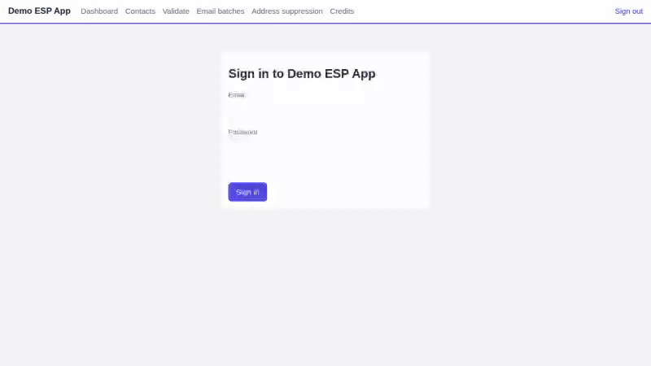
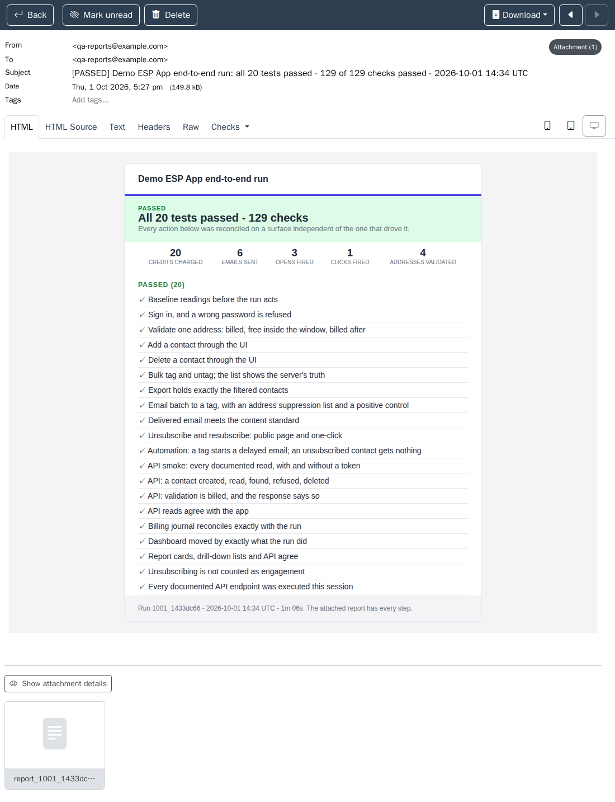
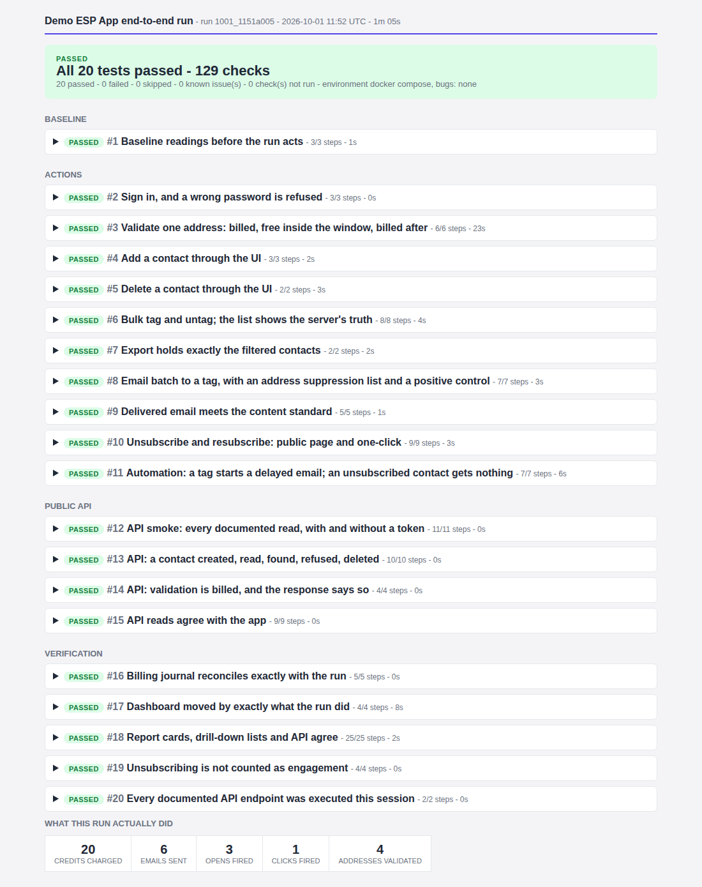
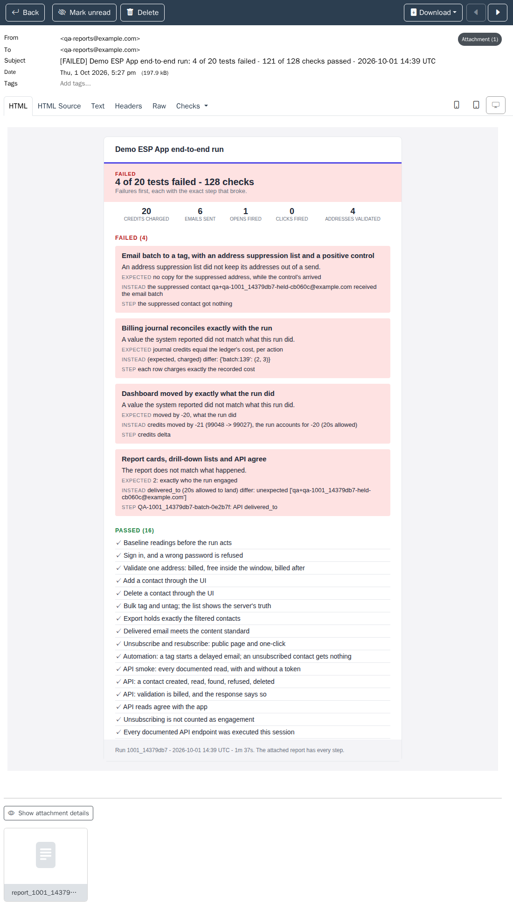
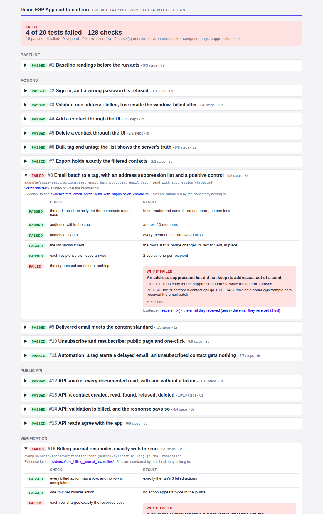

# saas-e2e-reference-architecture

[](https://github.com/TheodorGit/saas-e2e-reference-architecture/actions/workflows/ci.yml)
[](https://TheodorGit.github.io/saas-e2e-reference-architecture/)
[](example/app/bugs.py)


[](LICENSE)

End-to-end tests for a SaaS product, with a runnable example app. Besides driving the
UI, the suite checks each result somewhere else: every recipient's own copy in an
inbox, the billing journal against what the run charged, and the reports, API and
dashboard against each other and the run. Each test that guards a behaviour has a
defect switch in the example app that makes it fail at its check.



## What it tests

- **Email batches** reach their audience minus the address suppression list, checked
  with a positive control, and every delivered email meets the content standard.
- **An automation**: adding a tag sends an email after a delay, and a contact who
  unsubscribed gets nothing.
- **Address validation** is billed once, and free inside its rolling window.
- **Reports, the API and the dashboard** agree with each other and with the run,
  compared as sets.
- **The public API**: every documented endpoint is called, or the build fails.

## See it

- **[Open a live example report](https://TheodorGit.github.io/saas-e2e-reference-architecture/)**:
  a green run and a red one, with videos and the evidence of each failure.
- **Try it in your browser**:
  [](https://codespaces.new/TheodorGit/saas-e2e-reference-architecture?quickstart=1)
  then click **Create new codespace**. Run the command on the *Start here* page, then
  click **Open in Browser** on the notification to watch the tests. The run ends by
  showing its report email, then the full report.

## What a report looks like

Every run mails its report. The email lists the verdict and the failures; the full
report is attached as an HTML file, with every test, every step, a video of every
browser test and the evidence of each failed check. Both sample reports are online:
[green](https://TheodorGit.github.io/saas-e2e-reference-architecture/green/report.html) and
[red](https://TheodorGit.github.io/saas-e2e-reference-architecture/red/report.html).

**A green run.**

The email, with the full report attached at the bottom:



The attached report:



**A red run, with `suppression_leak` switched on.**

The email lists each failure with what was expected, what happened and the check:



The attached report shows the failed check next to the email the suppressed contact
received. The leak also shows in billing, the dashboard and the report:



## Context

This architecture is based on an end-to-end suite I built for Campaign Refinery, an
email-marketing SaaS, and is shared with the company's permission. It is a clean-room
re-implementation: the example app is fictional, and no internal data, code or product
details from the original are included.

## For technical teams

- [Architecture](docs/ARCHITECTURE.md): the twenty patterns, and the steps to apply them
  to your own product.
- [Case studies](docs/CASE_STUDIES.md): nine kinds of defect that end-to-end suites
  often miss, and the pattern that catches each.
- [Running it in detail](docs/RUNNING.md): timings, settings, working on the suite, CI.

### Run it locally

```
docker compose up --build --exit-code-from tests
```

This starts the example app (the Demo ESP App, a fictional email service provider), its
worker, an inbox and the test runner, runs the suite, and exits with pytest's code.

- **Watch it** at <http://localhost:7900>. The browser is slowed down, and clicking in
  the view does not affect the tests. `E2E_HEADLESS=1` runs at full speed without it.
- **Read the report** at `reports/latest.html`. It is also mailed to the run's inbox and
  saved next to the report as `email.html`.

#### Break it on purpose

Switch a defect on and the test that guards it fails:

```
# bash
DEMO_ESP_BUGS=suppression_leak docker compose up --build --exit-code-from tests
# PowerShell (the second line switches the defect off again)
$env:DEMO_ESP_BUGS = "suppression_leak"; docker compose up --build --exit-code-from tests
Remove-Item Env:DEMO_ESP_BUGS
```

The 19 defects are listed in [`example/app/bugs.py`](example/app/bugs.py). Each run's
report goes to `reports/<run id>-<defect>/`. CI runs the clean app and every defect on
each push: the clean run must pass, and each defect must fail in the test that guards
it, and elsewhere only where the bug matrix says it may.
